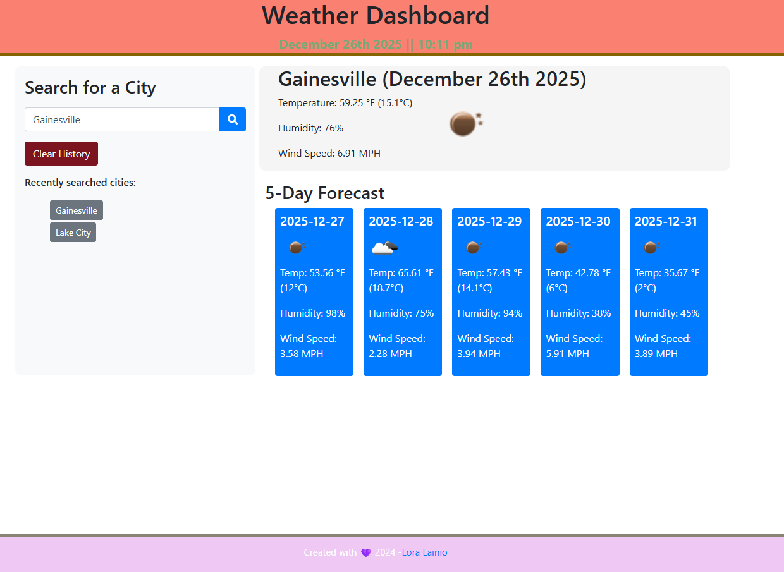

# 🌦️ Weather Dashboard

A high-performance, Vanilla JS weather application with real-time geocoding and responsive design.

## 🔗 Links

- **Live Demo**: [View Website](https://l-lainio.github.io/weather_board/)
- **Source Code**: [GitHub Repository](https://github.com/L-Lainio/weather_board)

## 📖 Project Overview

This project is a modern weather application designed for speed and accuracy. While many weather apps rely on heavy libraries, this version was built using pure Vanilla JavaScript to demonstrate high performance and clean code architecture. It provides users with instant weather data for any global location, including a detailed 5-day forecast.

## 🌟 Key Enhancements

- **Zero-Library Architecture**: Fully migrated from jQuery to modern ES6+ (Fetch API, Async/Await).
- **Smart Autocomplete**: Integrated Open-Meteo Geocoding for real-time city suggestions with a 300ms debounce to save bandwidth.
- **Persistent UX**: Deep integration with localStorage to maintain a seamless search history across browser sessions.
- **Adaptive Geolocation**: Automatically detects the user's current location to provide immediate local data.

## 🎞️ Interactive Demo

<video width="100%" controls>
  <source src="./assets/images/weatherDashDemo.mp4" type="video/mp4">
  Your browser does not support the video tag.
</video>

*(Dynamic search suggestions and 5-day forecast visualization)*

## 🛠️ Technical Stack

- **Logic**: JavaScript (ES6+), Fetch API
- **Styling**: CSS3, Bootstrap 5 (Responsive Layout)
- **APIs**: OpenWeatherMap (Weather & Forecast), Open-Meteo (Geocoding)
- **Storage**: Browser LocalStorage API

## 🚀 Technical Deep Dive

### 1. Data Fetching Strategy

I implemented a two-tier fetching system. Because standard weather APIs can be picky about city names, the app first converts user input into precise Latitude and Longitude coordinates via a Geocoding service before requesting weather data. This ensures a 99% success rate for location searches.

### 2. Performance Optimization

Instead of making an API call for every single keystroke, I built a Custom Debounce Function. This ensures the app waits until the user has finished typing before requesting suggestions, reducing unnecessary network traffic.

### 3. State Management

Search history is managed through a JSON-parsed array in localStorage. This ensures that even after a page refresh or browser restart, the user's previous searches remain clickable and functional.

## 🔧 Installation & Local Setup

1. Clone the repo: `git clone https://github.com/L-Lainio/weather_board.git`
2. Open `index.html` via Live Server in VS Code.
3. Add your own OpenWeatherMap API key in the `assets/config.js` file.
